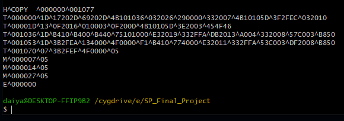

## SIC/XE Assembler

使用 C 實現 SIC/XE assembler，能夠組譯課本的 Figure 2.6。  

組譯後產出 object program 的 record 格式要跟課本 Figure 2.8 一樣。

### 1131 NTNU CSIE System Programming Final Project
- 課程代碼: CSU0027 [課程教材連結](https://web.ntnu.edu.tw/~ghhwang/course.html)(三校聯盟課程代碼: 3N1383701)
- 授課老師: Prof. Gwan-Hwan Hwang(黃冠寰 教授)
- 課程用書: System Software An Introduction To Systems Programming, by Leland L. Beck 
- 我的組譯器實作過程筆記: [請點此連結到 系統程式 期末專題 SIC/XE 組譯器 筆記](https://hackmd.io/@Dylan-Dai/rJlpnliIye)
- 如果想要每週作業和期中期末考古題，歡迎來信: daiyan.6666@gmail.com

### 壓縮檔內容
- `main.c` - 主程式，包含 Pass 1、Pass 2 與產出 object 檔。
- `input.txt` - 教授提供測資(課本的Figure 2.6)。
- `registers.txt` - register table: 組譯用，maps register names to register numbers。
- `mnemonic.txt` - opcode table: 組譯用，maps instruction mnemonics to format and opcode。
- `object_program.txt` - 產出的 object，需與課本 Figure 2.8 一樣 (H/T/M/E records)。

## 測試結果(產出 Object Program) (點擊縮圖可放大)
| Input (input.txt) | Output |
|-------------|-----------------|
|  |  |

## 如何使用
使用以下指令編譯程式:
```
gcc main.c
```
接著將要被組譯的程式放在 `input.txt` 裡，直接執行執行檔即可:
```
a.exe
```
