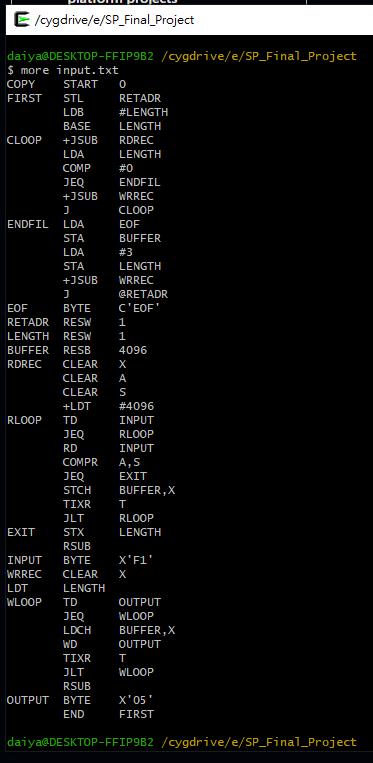

## SIC-XE-Assembler-System-Programming

Implement a SIC/XE assembler in C based on the textbook’s Figure 2.6 example and generate an object program in the record format shown in Figure 2.8.

1131 NTNU CSIE System Programming Final Project

- Course code: 3N1383701

- Instructor: Prof. Gwan-Hwan Hwang(黃冠寰 教授)

- My final project notes: [系統程式 期末專題 SIC/XE 組譯器 筆記](https://hackmd.io/GoPIZP9ASIWGcbJw0iDCIQ?view)

### Contents
- `main.c` - program entry point; Pass 1, Pass 2, and object file generation.
- `input.txt` - the SIC/XE assembly source file to be assembled.
- `registers.txt` - register table: maps register names to register numbers.
- `mnemonic.txt` - opcode table: maps instruction mnemonics to format and opcode.
- `object_program.txt` - output file storing the generated object program in textbook format (H/T/M records).

## Object Program Output
Each section of the object program corresponds directly to textbook Figure 2.8.



## Getting Started
To compile the program:
```
gcc main.c
```
To assemble the code in `input.txt`:
```
a.exe
```
The program will process `input.txt`, build symbol and opcode tables using `registers.txt` and `mnemonic.txt`, then output the object program into `object_program.txt`.
